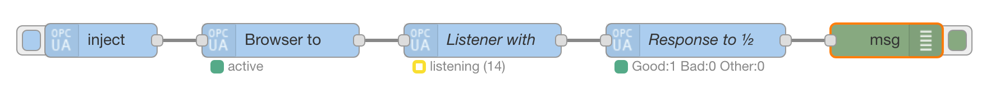
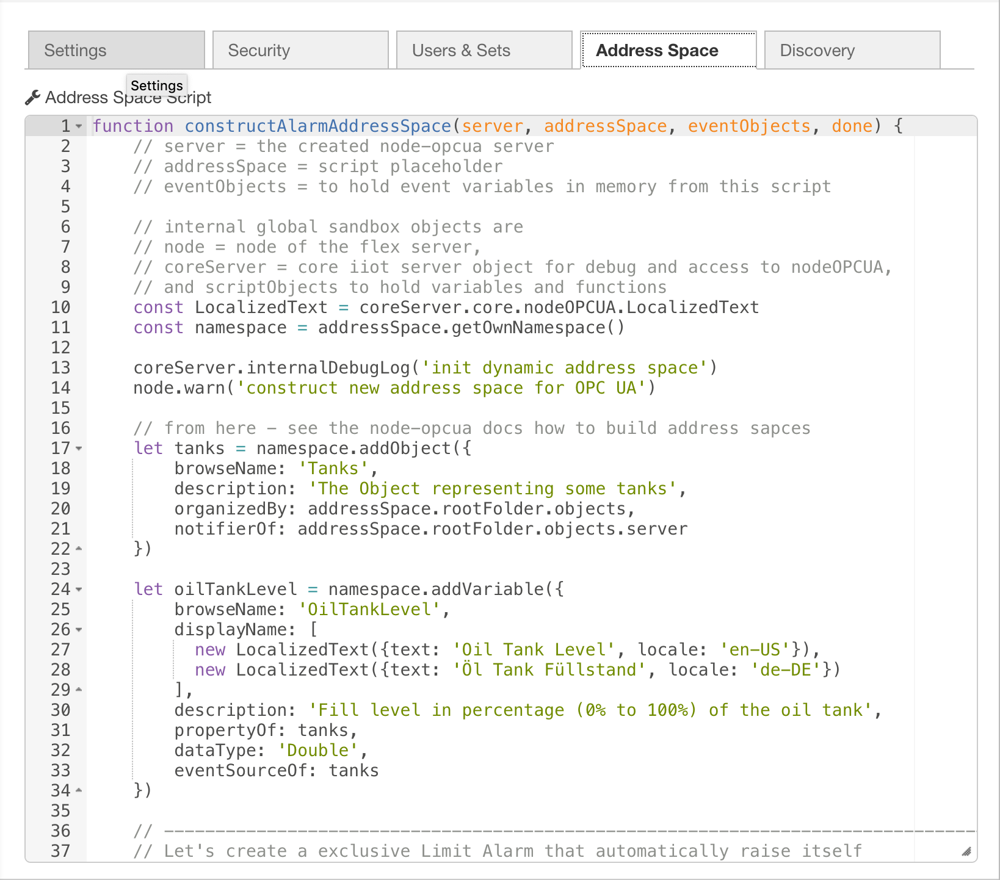
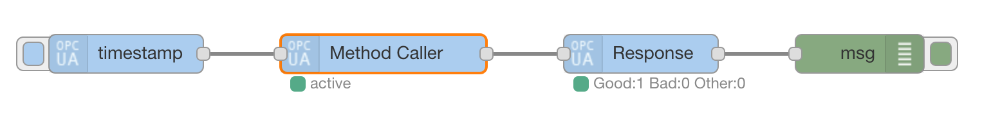
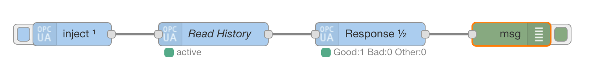
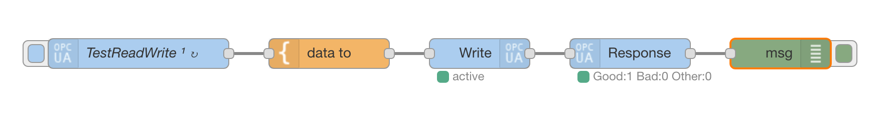
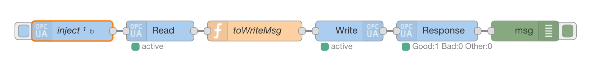
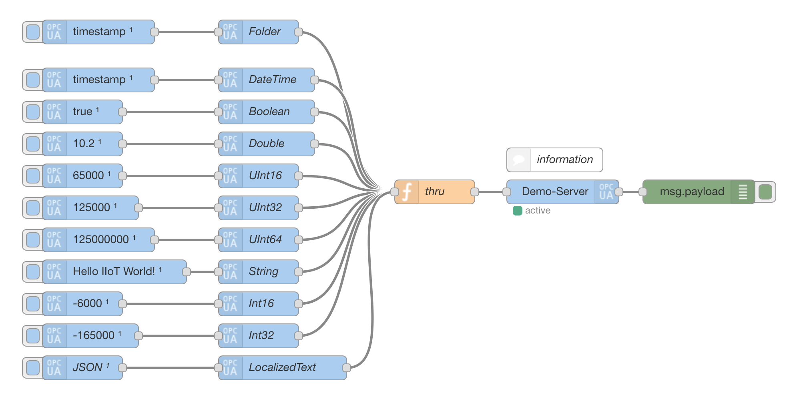
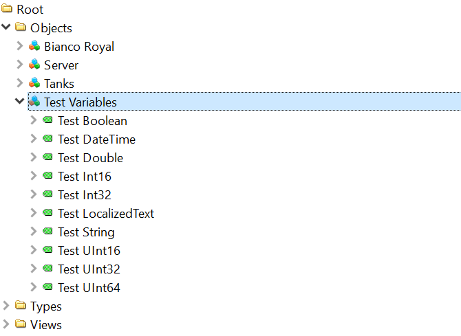
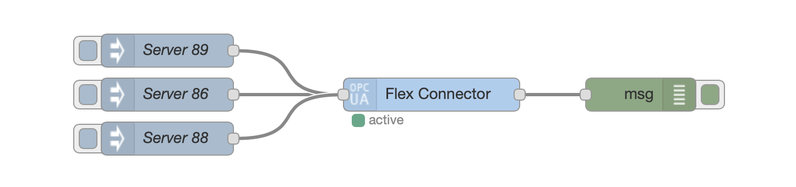

# node-red-contrib-iiot-opcua 


[](https://www.npmjs.com/package/node-red-contrib-iiot-opcua)


[](http://standardjs.com/)
[](https://www.npmtrends.com/node-red-contrib-iiot-opcua)
[](https://github.com/DATATRONiQ/node-red-contrib-iiot-opcua/actions/workflows/build.yml)
[](a url to a maintainability or code quality badge such as CodeClimate)
[](https://github.com/DATATRONiQ/node-red-contrib-iiot-opcua/actions/workflows/summary.yml)

## The IoT/IIoT OPC UA toolbox package for [Node-RED][3] based on [node-opcua][4].

This is an updated version of the project of the same name, which was deprecated by the [original developer][1] in April 2020. 
The original repository has been deleted from Github, so this is based on [this fork of a slightly outdated version of the project](https://github.com/cacamille3/node-red-contrib-iiot-opcua).* 
This project upgrades the original work by migrating to TypeScript, and updating dependencies, including updates to new major release versions of Node-RED (v0.19 to v2.2.2) and node-opcua (v0.4 to v2.64.1).

[](https://opcfoundation.org/developer-tools/specifications-unified-architecture/isa-95-common-object-model/)
[](http://www.plattform-i40.de/)

* tested with Node.js v14.19 and Node-RED v2.2.2
* based on node-opcua v2.64 (OPC UA v1.03)
* extendable with node-opcua-isa95

*The latest version published to NPM was 3.12.1, while this fork is based on 3.10.2.

## Installing

1. Navigate to your Node-RED data directly. This defaults to `$HOME/.node-red/`
2. Install via npm.
   ```shell
   npm install node-red-contrib-iiot-opcua
   ```

## Migrating from previous versions

The update from v3.x to v4.x changed the way some nodes are implemented.

### General Changes
- The message format was standardized. While in older versions, a lot of additional properties were placed directly into the message,
they have been moved into the message's payload (`msg.payload`). This is to ensure the standard Node-RED message format is used, where the message
itself may only contain an ID, a topic, and a payload. This means that any references like `msg.nodetype` should be changed to `msg.payload.nodetype`.

### Browser
- The option `singleBrowseResult` has been replaced with `multipleOutputs`, and the default value now combines all outputs into one message. To maintain the same output, replace `singleBrowseResult` with `multipleOutputs` and swap the corresponding boolean value (true becomes false, false becomes true).

### Flex-Server
- The `node-opcua` library is now directly accessible as `opcua`. This means all references to `coreServer.core.nodeOPCUA` should be replaced with `opcua`.
- `node.iiot.assert` is no longer accessible. The functionality can be replaced by using an `if` statement that throws a new error (`if (errorConfition) throw new Error('Error Message'`). Errors can be displayed by using a `catch` node connected to a `debug` node, which displys the entire message.


## Contributing

Every bit helps! If you come across any bugs, please [send a buge report](https://github.com/DATATRONiQ/node-red-contrib-iiot-opcua/issues/new?type=bug), or if you feel inclined to fix it yourself, [submit a pull request](https://github.com/DATATRONiQ/node-red-contrib-iiot-opcua/compare).

### Setting up local development

1. Ensure you are using node 14. This has been developed using node v14.19.1. If using Node Version Manager: `nvm install v14.19.1`
2. Install Node-RED to a separate directory.
   ```shell
   git clone git@github.com:node-red/node-red.git
   cd node-red
   git checkout tags/2.2.2 # pls see most recent 2.2.x tag for Node-RED
   npm install
   npm run build
   npm run start # This must be run once to initialize the ~/.node-red directory
   ```
3. Clone this repository into its own directry
   ```shell
   git clone git@github.com:DATATRONiQ/node-red-contrib-iiot-opcua.git
   cd node-red-contrib-iiot-opcua
   git checkout development
   npm install
   npm run build
   ```
4. Add `node-red-contrib-iiot-opcua` to Node-RED
   ```shell
   cd ~/.node-red
   npm install <path to where you have cloned the project>/node-red-contrib-iiot-opcua
   ```
5. Start Node-RED
   ```shell
   cd <...>/node-red
   npm run staart
   ``` 

### :warning: After making changes, remember to run `npm run build` in the `node-red-contrib-iiot-opcua` directory starting Node-RED! :warning:

### Debugging

To increase the verbosity of logging, enable debug modes and verbose logging.

Start debug with Node-RED in verbose (-v) mode to get a verbose logging:

    DEBUG=opcuaIIoT* npm run start -v 1>nodeREDIIoTOPCUA.log 2>&1

## Examples
### Basic Flow


### Your own address space model!

With the flex server you could create your own information model with the OPC UA address space.



### Learn with the examples!

The server node contains demo objects and variables
to start playing with OPC UA method call, read and write operations.

see Node-RED menu (right upper corner) -> Import -> Examples -> iiot opcua



**... secure reading from OPC UA servers with your own key pairs ...**



**... and secure writing and moving data between OPC UA servers ...**





**... create your own variables and objects from events ...**

| Node-RED                                         | UAExpert / Client                                         |
|--------------------------------------------------|-----------------------------------------------------------|
|  |  |

### Reconnect via events with the Flex Connector!



## Package Information

### License

The BSD 3-Clause License

[DATATRONiQ][5], current maintainer of node-red-contrib-iiot-opcua

This Node-RED package has been revitalized in 2022 and is based on the node-red-contrib-iiot-opcua package created by [Klaus Landsdorf][1] in 2017.
Copyright notices by Mika Karaila, Klaus Landsdorf, and others are to honor their work in previous years on Node-RED, OPC-UA, and node-red-contrib-iiot-opcua; we are very grateful for all the time and energy they've invested!!

[Klaus Landsdorf][1], creator of node-red-contrib-iiot-opcua

That is a whole new Node-RED package started in 2017 based on the node-opcua v0.4 and the API documentation.
The old copyrights by Mika Karaila are just to honor his pioneer work in the years 2015/2016 for Node-RED and OPC UA.

### Important

This is **not** an official product of the OPC Foundation or Plattform Industrie 4.0.

### Special thanks

Special thanks go to [Etienne Rossignon][2] for the [node-opcua][4] packages and very special for the node-opcua-isa95 package!
Special thanks also go to [Klaus Landsdorf][1] for creating _node-red-contrib-iiot-opcua_ in the first place!

[1]:https://github.com/biancode
[2]:https://github.com/erossignon
[3]:https://github.com/node-red/node-red
[4]:https://github.com/node-opcua/node-opcua
[5]:https://github.com/DATATRONiQ
